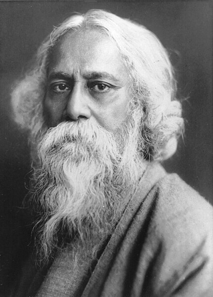

> 

## Rabindranath Tagore (1861 - 1941)

### Languages
Bengali, English

### Writings

| **Name**         | **Available on**                                                                |
|------------------|---------------------------------------------------------------------------------|
|                  |                                                                                 |

### Rabindrasangeet
<TBA>

### Paintings
<TBA>

### Translations
<TBA>

#### English
* <TBA>

### Digital media
<TBA>

### References
<TBA>
